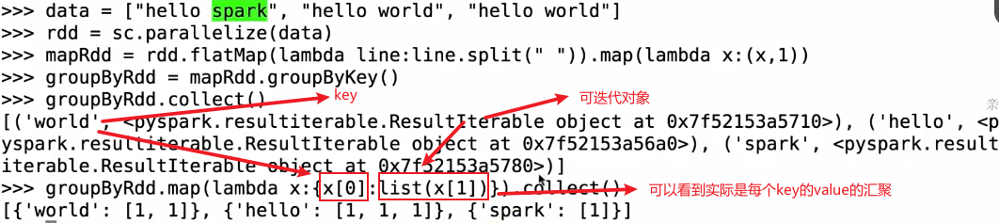
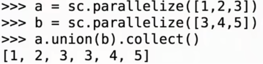
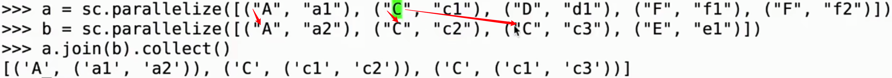

# 常用算子详解

## 1	RDD常用操作

### 1.1	transformers

- 作用
  可以根据一个已经存在的RDD创建一个新的RDD(RDDA —— transformer ——> RDDB)

- 例子

  - `map`
  - `filter`
  - `group by`
  - `distinct`

- 特点
  所有的transformer操作都是 **lazy** 的
  transformer不会立刻计算，只会记录(traggers)这些RDD的transformer，直到一个`action`请求返回结果到drive端，才会执行transformer，这使得Spark运行更为高效

  

### 1.2	actions

- 作用

  1. RDD经过一些计算，返回一个值到drive端
  2. 将数据写出到外部存储中

  以上两个操作都属于`action`

- 例子

  - `reduce`
  - `count`
  - `collect`


## 2	Transformer算子

### 2.1	map

- 作用
  将function函数作用到数据集的**每一个元素**上，并生成一个新的RDD

### 2.2	filter

- 作用
  选出所有function返回值为TRUE的元素，并生成一个新的RDD

- 示例
  ```python
  >>> data = sc.parallelize([12, 2, 3, 4, 5])
  >>> data1 = data.filter(lambda x: x>5)
  >>> data1.collect()
  ```

### 2.3	flatMap

- 作用
  输入的item能够被map到0或者多个array输出,再将这些array flat成一个sequence，返回值是一个sequence

### 2.4	groupByKey

- 作用
  
  rdd每个元素根据**第一个值**作为key进行分组（如果需要以其他的值作为key可以自己进行转换）
  
  **传入的RDD元素必须是pair对形式的**
  
  对pari形式的RDD将相同的key的数据分发到一起
  
- 案例
  

- reduceByKey
  实际是对groupByKey的value按照某种函数进行**规约**、计算（<font color="#f79646">是不是必须规约？</font>）

  ```python
  reduceByKey = RDD.groupByKey(lambda a, b: a+b)
  ```


### 2.5	reduceByKey

### 2.6	sortByKey

### 2.7	Union

类似于list的append



### 2.8	distinct

### 3.9	join

1. inner join

   `RDDA.join(RDDB)`

   

2. leftOutJoin
   `RDDA.leftOutJoin(RDDB)`

3. rightOutJoin


## 3	 Action算子

### 3.1	collect

### 3.2	count

	- min
	- max
	- sum 


### 3.3	reduce

### 3.4	take

### 3.5	saveAsTextFile 

### 3.6	foreach


 

## 4	Spark RDD案例实战

