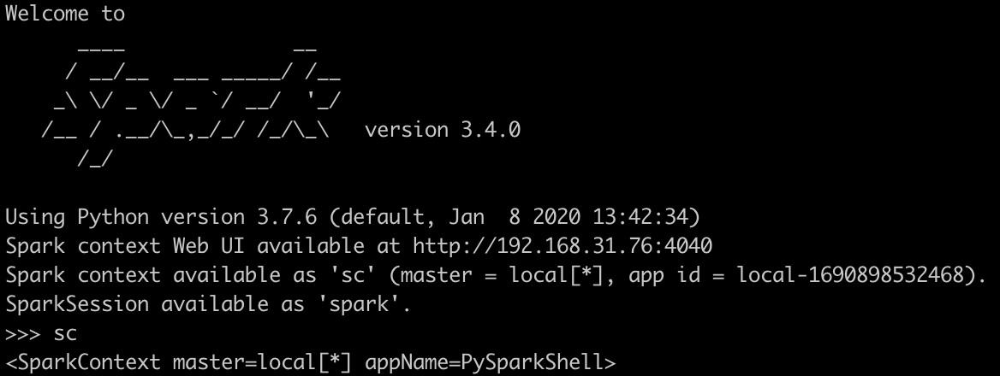

# 初识 RDD

## 1	RDD 的特性

- 五大特性
    1. RDD 是不可变的
      2. 一系列 partition 构成
      3. 一个函数可以对所有 partition 进行计算
         对一个 rdd 执行一个函数，实际上是对 RDD 的所有分区数据执行某种操作
         $y=f(x)$
         $rdd.map(\_+1)$
      4. RDD 是一个依赖<font color="#2DC26B">其他 RDD </font>的列表
         RDD\==> RDD 1\==> RDD 2\==> RDD 3 
         **例子：**
               RDDA（5 partition）\==> RDDB (5 partition)
               如果 RDDB 由 5 个分区的 RDDA 生成，那么 RDDB 也具有 5 个分区，并且**依赖关系**会被记录下来，如果 RDDB 的某个分区数据因为一些错误丢失，那么可以通过这种依赖关系对数据进行恢复
      5. 数据在哪个节点，优先将作业调度到该节点进行计算
         **移动数据不如移动计算** ， 减少磁盘的IO消耗

- 其他

     						1. RDD由N个分区组成，并分布在各个node上

     2. 一个Task处理一个分区的数据

     2. partition数据可以可以进行persist（持久化）操作，内存、磁盘

## 2	sparkconf和sparkcontext

### 2.1	sparkcontext

- 第一要务
  创建sparkcontext

- 什么是sparkcontext？
  pyspark.SparkContext，它是spark功能的**主入口点**，连接到spark集群 （loacl、standlone、yarn等）

- 作用
  - 通过sparkcontext创建RDD

  - 广播变量到集群

- 示例
  ```python
  from pyspark.context import SparkContext
  sc = SparkContext('local', 'test')
  ```

  

### 2.2	SparkConf

 在创建sparkcontext之前，需要创建**sparkconf**对象，其包含了一些应用的信息，设置spark的参数  

```python
conf = SparkConf().setAppName(appName).setMaster(master)
sc = SparkContext(conf=conf)
```

通过 `pyspark` 命令启动 python，并在命令行中 `sc` 可以看到



可以看到已经存在 appname 了，这是因为在启动 pyspark 程序的时候，源码中包含了:

```shell
exec "${SPARK_HOME}"/bin/spark-submit pyspark-shell-main --name "PySparkShell" "$@"
```


## 3	RDD 的创建

### 3.1	parallelizing an collection

​	通过 sc 的 `parallelize` 方法，在 drive 端将一个已经存在的**可迭代的**或者**一个集合**， parallelizing 一个已经存在的集合。

```python
data = [1, 2, 3, 4, 5]
distData = sc.parallelize(data， 5) # 5为数据被切分的分区数
```

一旦RDD被创建，这个RDD就可以被从并行化操作


partition的数量直接影响到运行时的性能，通常情况下一个cpu一般设置2-4个partition， 充分利用cpu的性能，一般情况下，sparrk会自动设置partition的数量，也支持手动指定

### 3.2	referencing a dataset 

​	在外边存储系统中（共享的文件系统:HDFS 、Hbase、Hive或者其他提供**Hadoop InputFormate的数据源**）

​	Spark支持textFile、SequenceFiles或者其他的Hadoop InputFormate文件

1. TextFile方法
   使用sc的`textFile`方法，不仅可以传入本地（`file:///home/jarven/data.txt`)的一个文件，也可以类似与HDFS等文件（ `hdfs://`, `s3a://`）

   ```python
   sc.textfile('file:///home/jarven/data.txt').collect()
   sc.textfile('hdfs://hadoop000:8020/data.txt').collect()
   ```

   **注意：**使用本地文件系统的时候，必须保证在每个node都可以在相同的路径上访问到该文件

2. 

