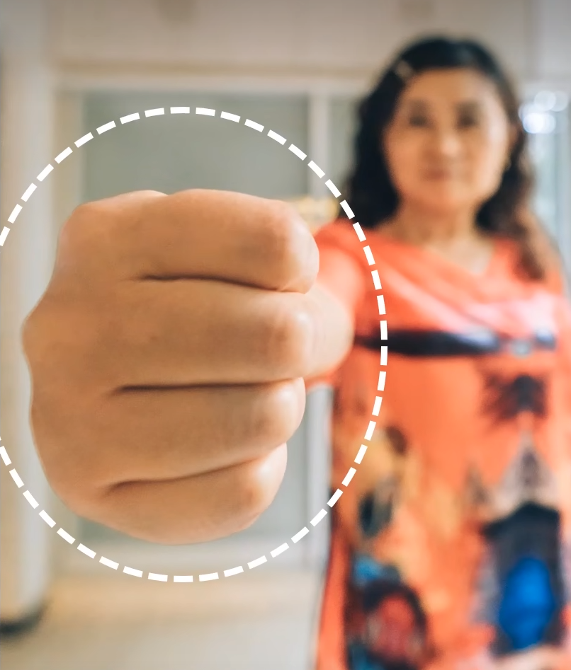
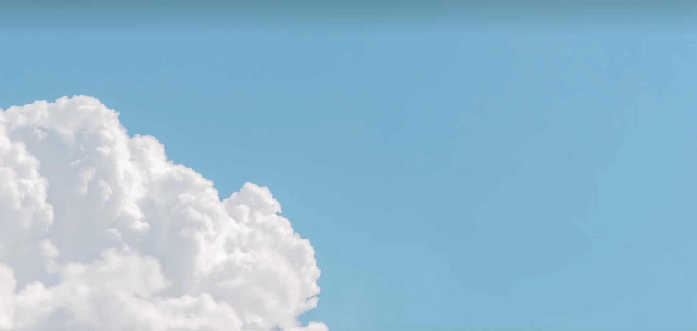
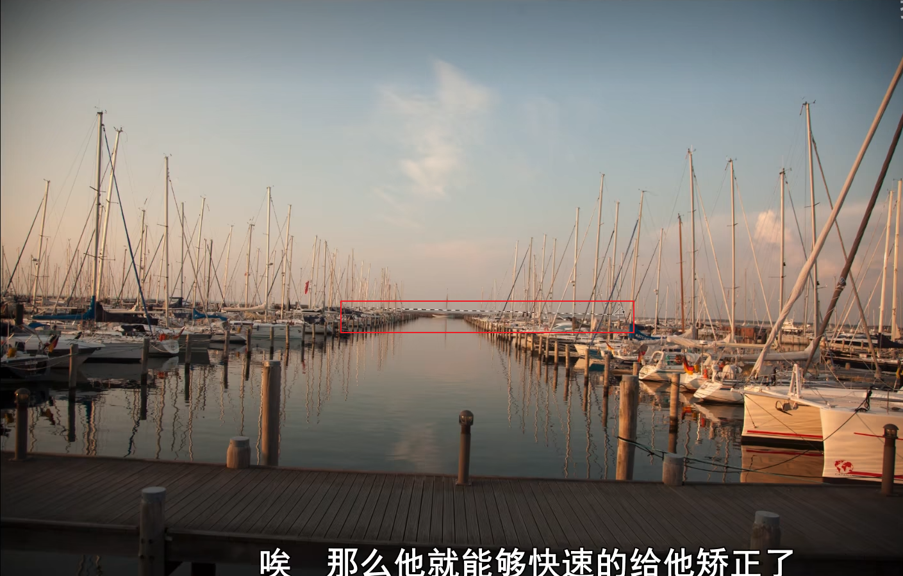
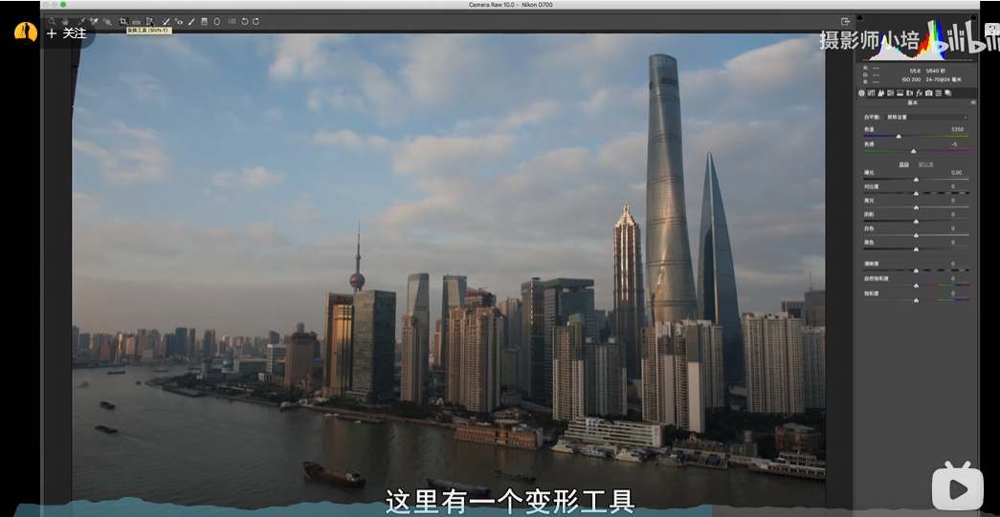

# 构图

好的构图实在能清晰的表达照片**主题**的前提下，让照片足够的**简洁**

- 增强主题
  - 改变视角（仰视衬托山峰险峻）
  - 添加对比（衬托大小、衬托颜色）
- 简洁
  - 对画面做减法（去除与主题无关的元素）

## 1 构图

### 1.1 点构图

### 1.2 二分构图

### 1.3 三分线构图

### 1.4 前景构图

塑造立体感

- 前景与主题相关

### 1.5 框架构图

前景构图的特殊方式

更加突出主体

### 1.5 填充构图

广角产生透视和形状变化，常用于表现夸张情绪的任务或者动物

### 1.6 留白构图

小清新图片中使用较多

### 1.7 对比构图

## 2 二次构图

### 2.1 拉直工具

利用lightroom的拉直工具，将照片进行二次构图，将照片地平线、水平线变得周正。

### 2.2 裁切

### 2.3 形变工具

当使用**拉直工具，发现建筑物形变**时，可以不用 拉直工具用这个形变工具

形变+裁切
