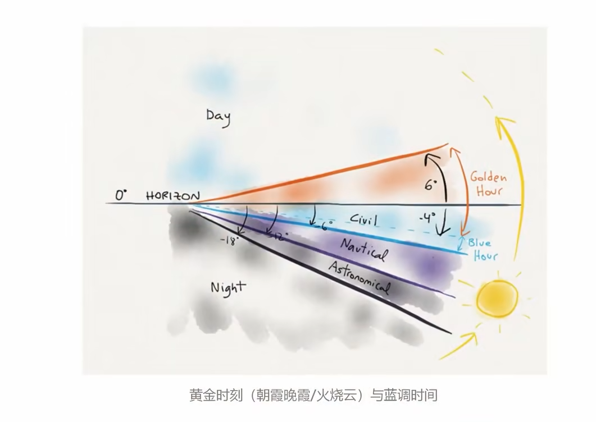
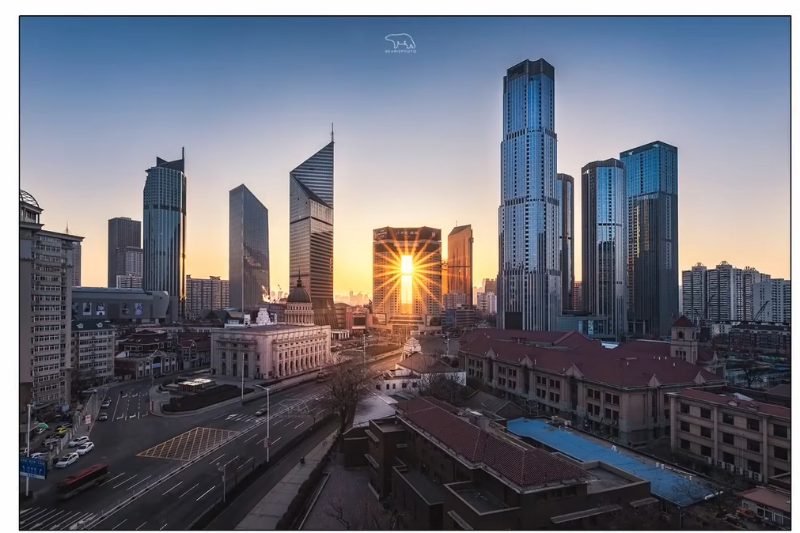
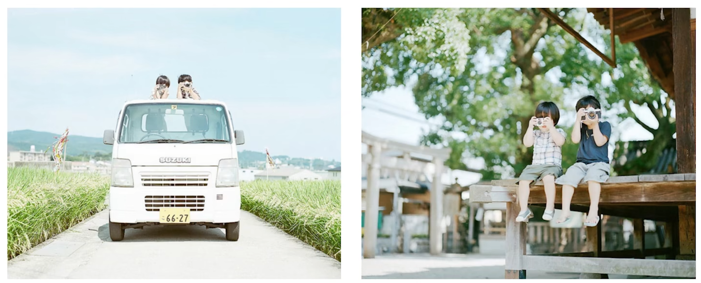
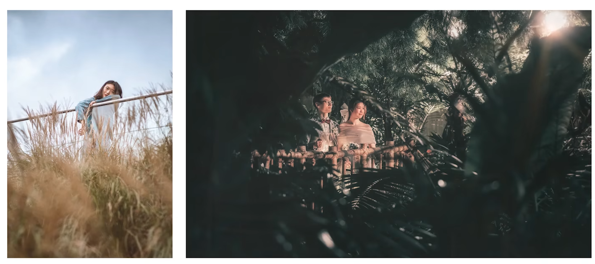
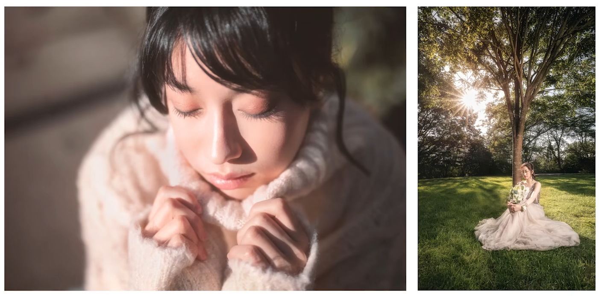

# 实战摄影

## 1 自然风光

### 1.1 通用参数

| 拍摄情况 | 曝光模式 | 感光度 | 光圈   | 快门 | 曝光     |
| -------- | -------- | ------ | ------ | ---- | -------- |
| 正常光比 | A/AV     | 100    | F8-F16 | Auto | 向右曝光 |
| 大光比   | A/AV     | 100    | F8-F10 | Auto | 包围曝光 |
| 超长曝光 | B        | 100    | F8-F10 | B    | 向右曝光 |

## 2 城市风光

### 2.1 时间选择

### 2.1 天气选择

- 有云
- 无云
  蓝调
- 轻度雾霾

### 2.3 通用参数

| 拍摄情况 | 曝光模式 | 感光度 | 光圈   | 快门 | 曝光     |
| -------- | -------- | ------ | ------ | ---- | -------- |
| 正常光比 | A/AV     | 100    | F8-F16 | Auto | 向右曝光 |
| 大光比   | A/AV     | 100    | F8-F10 | Auto | 包围曝光 |
| 超长曝光 | B        | 100    | F8-F10 | B    | 向右曝光 |

### 2.4 星芒效果

- 小光圈（F11更小）
- 慢快门（长曝光）

## 2.4 长曝光

### 2.4.1 流云+雾化水面

运用ND镜+长曝光（25S+）

### 2.4.2 车轨

- 曝光时间尽可能长
  车流轨迹穿过整个画面
- 尽量拍摄多张
  使用堆栈，使得车流更加密集
- 选择车流量较大时
- 选择多次的来车方向拍摄

## 3 人像拍摄

### 3.1 风格

1. **日系风格——滨田英明**
   
2. **欧美风格**
3. **时尚大片**

### 3.2 拍摄技巧

1. 参数设置
   | 拍摄情况 | 曝光模式 | 感光度     | 光圈   | 快门 | 曝光     |
   | -------- | -------- | ---------- | ------ | ---- | -------- |
   | 自然光   | A/AV     | 据情况而定 | 大光圈 | Auto | 优先人物 |
   | 常亮灯   | A/AV     | 据情况而定 | 大光圈 | Auto | 优先人物 |
2. 技巧
   - 利用道具
   - 利用前景
     利用前景，提升纵深感
     
   - 寻找窗户
     增加反光
   - 跟着光走
     注意光的角度
     

## 4 月亮拍摄

### 4.1 器材和参数

- 器材
  - 长焦镜头
     70-200, 100-400, 150-600
  - 三脚架
- 参数
  - 曝光模式：M 档
  - ISO: 200
  - 快门：1/500
  - 光圈：F5.6-F8

